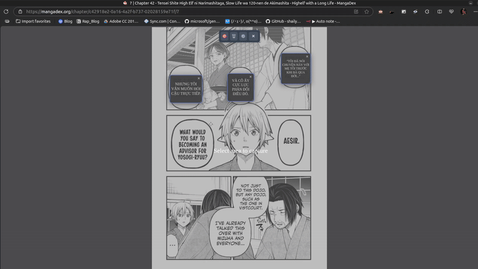

# Screen Translator

A powerful Chrome Extension that helps you translate text on screen instantly using OCR and AI technology. Especially useful for reading manga, comics, documents, and foreign language content.

## 🎬 Demo



*Quick demonstration of capturing and translating text from any webpage*

## ✨ Key Features

- 🖼️ **Capture & Translate**: Select screen areas to automatically recognize and translate text
- 🤖 **AI Translation**: Uses Google Gemini AI for accurate and natural translations
- 👁️ **Smart OCR**: High-accuracy text recognition using OCR.space API
- 🌐 **Multi-language**: Support for multiple input and output languages
- 📱 **User-friendly Interface**: Draggable and resizable translation widgets
- ⚙️ **Flexible Customization**: Configure API, AI models, and languages as needed

## 🚀 Installation

### Requirements
- Google Chrome or Chromium-based browser
- Google Gemini API key (free)
- OCR.space API key (You can try: `copyfishonly_24`)

### Step 1: Build the extension
```bash
# Clone repository
git clone <repository-url>
cd screen-translater

# Install dependencies
npm install

# Build extension
npm run build
```

### Step 2: Install in Chrome
1. Open Chrome and navigate to `chrome://extensions/`
2. Enable **Developer mode** (top right corner)
3. Click **Load unpacked** and select the `dist` folder
4. The extension will appear in the list as "Screen Translator"

### Step 3: Get API Keys

#### Google Gemini API Key
1. Visit [Google AI Studio](https://makersuite.google.com/app/apikey)
2. Sign in with your Google account
3. Create a new API key
4. Copy the API key for use

#### OCR.space API Key
1. Visit [OCR.space Free API Key](https://ocr.space/ocrapi/freekey)
2. Register for a free account
3. You'll receive your API key via email
4. Free tier includes 25,000 requests/month

(You can try: `copyfishonly_24`)

## ⚙️ Configuration

### Basic Setup
1. Right-click the extension icon and select **Options**
2. Enter your **Gemini API Key** in the "Gemini API Key" field
3. Enter your **OCR.space API Key** in the "OCR.space API Key" field.
4. Configure the settings:
   - **Target Language**: Destination language (e.g., vi for Vietnamese)
   - **OCR Language**: Source language (e.g., eng for English)
   - **Model**: AI model (recommended: `gemini-2.5-flash-lite`)
5. Click **Save Settings**

### Advanced Options
- **Temperature**: Translation creativity level (0.8 is optimal)
- **System Prompt**: Custom prompt for AI (leave empty for default)
- **API URL**: API endpoint (default is Google Gemini)

## 📖 Usage Guide

### Basic Text Translation
1. Open a webpage with content to translate
2. Click the **Screen Translator** icon in the toolbar
3. A toolbar will appear with buttons:
   - **➕** Add new translation
   - **🗑️** Delete all translations
   - **⚙️** Open settings
   - **✕** Close toolbar

### Capture and Translate
1. Click the **➕ (Add)** button on the toolbar
2. Drag to select the area containing text to translate
3. The extension will automatically:
   - Capture the selected area
   - Recognize text (OCR)
   - Translate to target language
   - Display result in a widget

### Managing Translation Widgets
- **Move**: Drag widget to change position
- **Resize**: Drag widget corners to resize
- **Delete**: Click the **×** button on the widget
- **Delete All**: Click the **🗑️** button on the toolbar

## 🌍 Supported Languages

### OCR Languages (Input) - OCR.space API
- `ara` - Arabic
- `bul` - Bulgarian
- `chs` - Chinese Simplified
- `cht` - Chinese Traditional
- `hrv` - Croatian
- `cze` - Czech
- `dan` - Danish
- `dut` - Dutch
- `eng` - English
- `fin` - Finnish
- `fre` - French
- `ger` - German
- `gre` - Greek
- `hun` - Hungarian
- `kor` - Korean
- `ita` - Italian
- `jpn` - Japanese
- `pol` - Polish
- `por` - Portuguese
- `rus` - Russian
- `slv` - Slovenian
- `spa` - Spanish
- `swe` - Swedish
- `tha` - Thai
- `tur` - Turkish
- `ukr` - Ukrainian
- `vnm` - Vietnamese
- `auto` - Auto-detect Language

### Target Languages (Output)
- `vi` - Vietnamese
- `en` - English
- `zh` - Chinese
- `ja` - Japanese
- `ko` - Korean
- `fr` - French
- `de` - German
- `es` - Spanish

## 🛠️ Development

### Tech Stack
- **Frontend**: TypeScript + Chrome Extension APIs
- **OCR**: OCR.space API
- **AI**: Google Gemini API
- **Build**: Vite + npm

### Scripts
```bash
# Build production
npm run build
```

### Project Structure
```
src/
├── background.ts     # Main service worker
├── content.ts        # Content script handling OCR and API
public/
├── manifest.json     # Chrome extension manifest
├── options.html      # Settings page
├── options.js        # Settings page logic
└── options.css       # Settings page styles
```

## 🐛 Troubleshooting

### Extension not working
- Check if both API keys are configured properly
- Ensure stable internet connection
- Refresh the webpage and try again

### OCR inaccuracy
- Select clear text areas without blur
- Ensure OCR language matches the text
- Very small text or noisy images may affect accuracy
- OCR.space free tier has 1MB file size limit

### Translation inaccuracy
- Try adjusting temperature (0.3-1.0)
- Check if target language is correct
- Consider customizing system prompt for special cases

### API Limits
- **OCR.space Free**: 25,000 requests/month, 1MB file size limit
- **Gemini Free**: Check [Google AI Studio](https://makersuite.google.com/) for current limits

## 📝 License

MIT License - See LICENSE file for details.

## 📞 Support

If you encounter issues or have suggestions, please create an issue on the GitHub repository.
